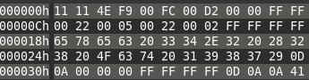
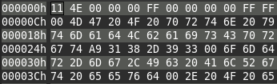
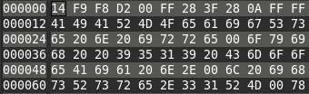
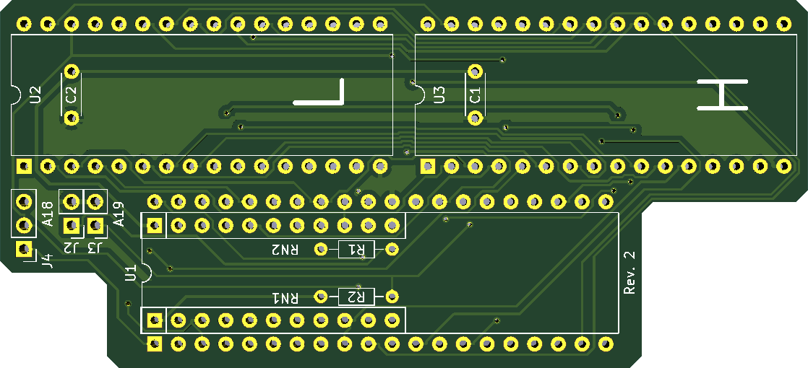

# A500/A2000 EPROM Adapter

## Introduction

In this repository You'll find two no-frills boards that I designed with a simple problem to solve: allow me to install **multiple Kickstarts** in my Amiga 500 rev.5 units without having to shell out money for an expensive 27C400 that I then need to rewire to make compatible.

The board includes sockets for pullup resistors that are oftentimes required (if your Amiga doesn't already have them) when fitting an new EPROM.

The board accepts **two** 27C020/040/080 EPROMs programmed with concatenated Kickstart images.

## EPROMs Configuration

The Amiga 500 uses a 16-bit bus to access the Kickstart, as such, the original ROM and its replacements must be 16-bit memories: expensive and annoying to program.

This board merges the data path of two 8-bit EPROMs (cheaper, easier to program) to rebuild the 16-bit data path.

One must take care to divide the original Kickstart dumps in two halves by separating the most significant byte of each Word into a file, and the least significant into another.

See the following example. The following is a partial hex dump of Kickstart 1.3 for A500:



Once we split its words in High and Low bytes we'll get the following dump for the High part:



And the following for the Low part:



The **High** part will have to be inserted in the slot marked as **H** and the **Low** part in the slot marked as **L**.

### A500 rev.5 configuration

The Amiga 500 rev.5 uses a non-standard pinout in its Kickstart socket: A17 line is connected to PIN 31, while it is normally on PIN 1 of the ROM chip.

You can wire the adapter to use this pinout by **bridging pins 2-3 of the J4 header**. If pins 1-2 are bridged, the A17 line goes to PIN 1.

### EPROM slots

Depending on which type of EPROM you use, you can fit a different number of Kickstart images in them.

- 27C020: 1 kickstart slot
- 27C040: 2 kickstarts slots (selectable with the A18 jumper)
- 27C080: 4 kickstarts slot (selectable by combining the A18 and A19 jumpers)

A18 and A19 are pulled-up through 4.7k resistors.

Every slot can host a 512kb Kickstart. If you wish to put a 256kb Kickstart in the slot, concatenate it with a copy of itself (stay on the safe side!).

To create an image to burn on the EPROMs I suggest following this procedure:

1. Take the required Kickstarts
2. Double the size of every 256kb Kickstary by concatenating it with a copy of itself
3. Concatenate the desired Kickstart dumps
4. Split the resulting binary file in high and low halves
5. Burn the halves to their respective EPROMs

The result will be like this for a 27C040:

```text
              HIGH EPROM     LOW  EPROM
         / .--------------.--------------.
        |  | 256k Kick A  | 256k Kick A  |
SLOT 1 <   +--------------+--------------+
        |  | 256k Kick A  | 256k Kick A  |
         \ +--------------+--------------+
         / |              |              |
        |  |     512k     |     512k     |
SLOT 2 <   |    Kick B    |    Kick B    |
        |  |              |              |
         \ '--------------'--------------'
```

## Board Variants

You'll find two variants of the same board in this repository. One uses DIP32 EPROMs, the other PLCC32. I advice to use sockets in both variants.

PLCC32 version is a bit harder to solder, but is more compact.

**Install RN1 and RN2 only if your Amiga lacks pull-up resistors on the data lines**. Also, the **R1 and R2 resistors are to be installed ONLY if you fit a 9-resistor bussed network (so, 10 pin and not 11) or if you did not fit a resistor network at all** on RN1 and RN2. 11 pin bussed arrays are a bit hard to come by, so you can fit a 10 pin one and install two discrete resistors to make up for the missing ones.

### DIP32 Variant



#### BOM

- C1, C2: 100nF ceramic capacitors
- J2, J3: 1x2 2.54mm PCB headers
- J4: 1x3 2.54mm PCB header
- U2, U3: DIP32 sockets
- U1: install 2x20pin 2.54mm headers on the underside. **Find thin ones that can fit into sockets**.
- RN1, RN2: either 11 or 10pin 4.7k ohm bussed resistor networks.
  - If you fit a 10pin ones (9 resistor + common pin), leave the last pin empty and fit R1 and R2.
  - If you fit 11pin ones (10 resistors + common pin), leave R1 and R2 empty
- R1, R2: 4.7k ohm resistors. Read point above to see if you must install them or not.
- 2x 27C020/040/080 EPROMs, DIP32

### SMD PLCC32 variant


#### BOM

- C1, C2: 100nF ceramic capacitors
- J2, J3: 1x2 2.54mm PCB headers
- J4: 1x3 2.54mm PCB header
- U2, U3: PLCC32 SMD sockets
- U1: install 2x20pin 2.54mm headers on the underside. **Find thin ones that can fit into sockets**.
- RN1, RN2: either 11 or 10pin 4.7k ohm bussed resistor networks.
  - If you fit a 10pin ones (9 resistor + common pin), leave the last pin empty and fit R1 and R2.
  - If you fit 11pin ones (10 resistors + common pin), leave R1 and R2 empty
- R1, R2: 4.7k ohm resistors. Read point above to see if you must install them or not.
- 2x 27C020/040/080 EPROMs, DIP32
